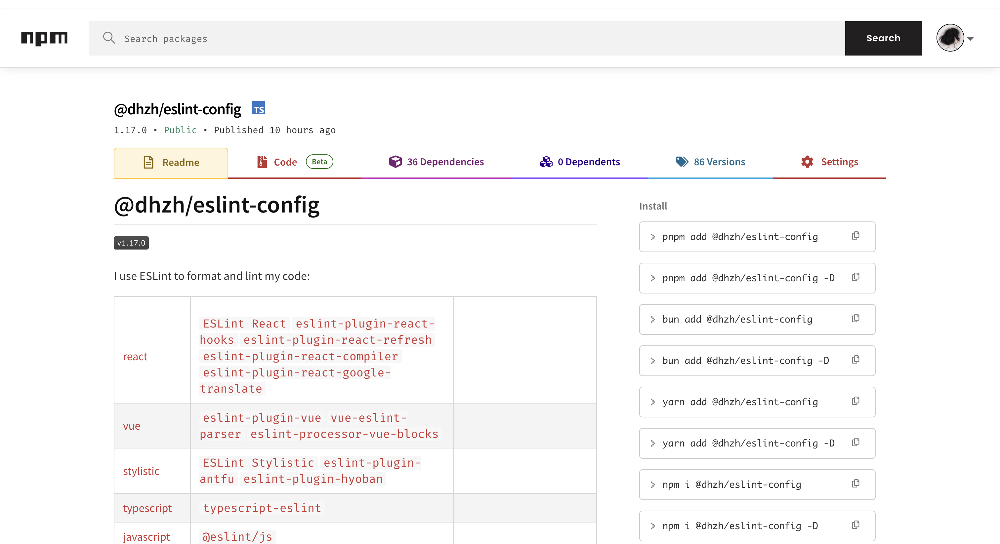

# Add More Install Commands On NPM Package Page

A Tampermonkey user script that enhances NPM package pages by adding multiple package manager install commands (`yarn`, `pnpm`, `bun`) alongside the default `npm` command. Supports both regular and dev dependencies with one-click copy functionality.

## Installation and Usage

1. Install the script from [here](./index.js).
2. Add the script follow the Tampermonkey guide.
3. Refresh the NPM repository package page.
4. You should see the install commands for `pnpm`/`bun`/`yarn`.

## License

[MIT](./LICENSE)
